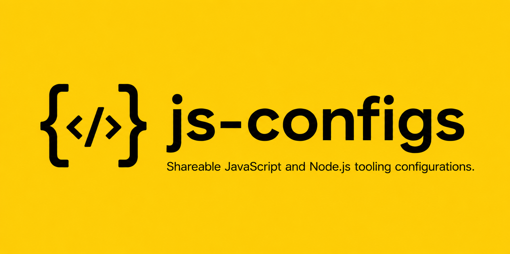

# js-configs

<p align="center">
  
</p>

<p align="center">
  <a href="https://andrewmcodes.github.io/js-configs/"></a>
  <a href="https://github.com/andrewmcodes/js-configs/actions/workflows/ci.yml"></a>
  <a href="https://www.npmjs.com/package/@andrewmcodes/prettier-config"></a>
  <a href="https://www.npmjs.com/package/@andrewmcodes/commitlint-config"></a>
  <a href="./LICENSE"></a>
  <a href="https://github.com/changesets/changesets"></a>
</p>

Shareable JavaScript and Node.js tooling configuration packages by [Andrew Mason](https://github.com/andrewmcodes).

This is a lightweight [pnpm workspace](https://pnpm.io/workspaces) monorepo. Each package is independently versioned and published to npm. The root package is private and exists only for development tooling, CI, and release automation.

## Packages

| Package | Description |
| --- | --- |
| [`@andrewmcodes/prettier-config`](./packages/prettier-config) | Shareable [Prettier](https://prettier.io/) configuration. |
| [`@andrewmcodes/commitlint-config`](./packages/commitlint-config) | Shareable [commitlint](https://commitlint.js.org/) configuration. |

## Development

This repo uses [mise](https://mise.jdx.dev/) to provision Node.js (pinned in `.node-version`) and to enable [Corepack](https://nodejs.org/api/corepack.html), which installs the [pnpm](https://pnpm.io/) version pinned in `package.json`. pnpm manages the workspace.

```bash
mise install # installs Node.js and enables Corepack-managed pnpm
pnpm install
```

Common checks:

```bash
pnpm lint
pnpm test
pnpm format:check
```

Fix formatting:

```bash
pnpm format
```

## Releases

Versioning and publishing are handled by [Changesets](https://github.com/changesets/changesets).

1. Make a change to a package.
2. Run `pnpm changeset` and describe the change.
3. Open a pull request including the generated changeset.
4. CI validates install, lint, test, format, and changeset status.
5. After merge to `main`, Changesets opens a release PR that bumps versions and updates changelogs.
6. Merging the release PR publishes the changed packages to npm via [Trusted Publishing](https://docs.npmjs.com/trusted-publishers) with provenance.

The root package is never published, and only changed packages are released.

## Contributing

- Use [Conventional Commits](https://www.conventionalcommits.org/) for commit messages.
- Add a changeset for any user-facing package change.
- Keep packages small, directly publishable, and free of unnecessary build steps.

See [`AGENTS.md`](./AGENTS.md) for the full repository rules.

## License

[MIT](./LICENSE) © Andrew Mason
